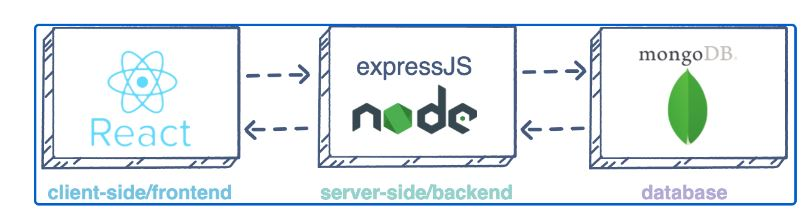

## Project 3 - MERN Stack Implementation


MERN Web stack consists of following components:

**MongoDB**: A document-based, No-SQL database used to store application data in a form of documents.

**ExpressJS**: A server side Web Application framework for Node.js.

**ReactJS**: A frontend framework developed by Facebook. It is based on JavaScript, used to build User Interface (UI) components.

**Node.js**: A JavaScript runtime environment. It is used to run JavaScript on a machine rather than in a browser.




### Task ###
To deploy a simple To-Do application that creates To-Do lists.

## STEP 1 – BACKEND CONFIGURATION ##
- Update ubuntu
```
sudo apt update
```


- Upgrade Ubuntu
```
sudo apt upgrade
```


- Get the location of Node.js software from Ubuntu repositories
```
curl -fsSL https://deb.nodesource.com/setup_18.x | sudo -E bash -
```


- Install Node.js and NPM on the server
```
sudo apt-get install -y nodejs
```

 **Note**: The command above installs both **nodejs** and **npm**. NPM is a package manager for Node like apt for Ubuntu, it is used to install Node modules & packages and to manage dependency conflicts.

- Verify the node installation with the command below:
```
node -v 
npm -v
```


*Application Code Setup*
-  Create a new directory for your To-Do project:

- Change your current directory to the newly created one:
```
cd Todo
```
- Use the command *npm init* to initialise your project, so that a new file named package.json will be created. This file will normally contain information about your application and the dependencies that it needs to run. Follow the prompts after running the command. You can press *Enter* several times to accept default values, then accept to write out the *package.json* file by typing *yes*.
```
npm init
```


- Install ExpressJs and create the *Routes* directory
```
npm install express
```


- Create a file *index.js* with the command below:
```
touch index.js
```
- Install the dotenv module
```
npm install dotenv
```


- Open the index.js file with the command below
```
vim index.js
```
Type the code below into it and save.
```
const express = require('express');
require('dotenv').config();

const app = express();

const port = process.env.PORT || 5000;

app.use((req, res, next) => {
res.header("Access-Control-Allow-Origin", "\*");
res.header("Access-Control-Allow-Headers", "Origin, X-Requested-With, Content-Type, Accept");
next();
});

app.use((req, res, next) => {
res.send('Welcome to Express');
});

app.listen(port, () => {
console.log(`Server running on port ${port}`)
});
```
Notice that we have specified to use port 5000 in the code. Use *:w* to save in vim and use *:qa* to exit vim.

- Start the server to confirm that it works and running on port :**5000**
```
node index.js
```


- Open this port(5000) in EC2 Security Group.

- Access your server’s Public IP or Public DNS name followed by port 5000:
```
http://<PublicIP-or-PublicDNS>:5000
```


**Routes**

There are three actions that our To-Do application needs to be able to do:

- Create a new task
- Display list of all tasks
- Delete a completed task

Each task will be associated with some particular endpoint and will use different standard HTTP request methods: POST, GET, DELETE. For each task, create routes that will define various endpoints that the *To-do* app will depend on.
- Create a folder *routes* and CD into the directory
```
mkdir routes
cd routes
```
- Create a file *api.js* and Open with vim:
```
touch api.js && vim api.js

```
- Copy below code in the file
```
const express = require ('express');
const router = express.Router();

router.get('/todos', (req, res, next) => {

});

router.post('/todos', (req, res, next) => {

});

router.delete('/todos/:id', (req, res, next) => {

})

module.exports = router;
```
- Create a model since the app is going to make use of Mongodb which is a NoSQL database. A model is at the heart of JavaScript based applications, and it is what makes it interactive and also used to define the database schema. The Schema is a blueprint of how the database will be constructed, including other data fields that may not be required to be stored in the database. These are known as virtual properties.

To create a Schema and a model, install *mongoose* which is a Node.js package that makes working with mongodb easier.
- Change directory back Todo folder with cd .. and install Mongoose
```
npm install mongoose
```


- Create a new folder *models*, cd into the new folder and create a file *todo.js*
```
mkdir models && cd models && touch todo.js
```
- Open the file created with vim todo.js then paste the code below in the file:
```
const mongoose = require('mongoose');
const Schema = mongoose.Schema;

//create schema for todo
const TodoSchema = new Schema({
action: {
type: String,
required: [true, 'The todo text field is required']
}
})

//create model for todo
const Todo = mongoose.model('todo', TodoSchema);

module.exports = Todo;
```
- Update the routes from the file *api.js* in ‘routes’ directory to make use of the new model.
In Routes directory, open *api.js* with vim api.js, delete the code inside with *:%d* command and paste there code below into it then save and exit.
```
const express = require ('express');
const router = express.Router();
const Todo = require('../models/todo');

router.get('/todos', (req, res, next) => {

//this will return all the data, exposing only the id and action field to the client
Todo.find({}, 'action')
.then(data => res.json(data))
.catch(next)
});

router.post('/todos', (req, res, next) => {
if(req.body.action){
Todo.create(req.body)
.then(data => res.json(data))
.catch(next)
}else {
res.json({
error: "The input field is empty"
})
}
});

router.delete('/todos/:id', (req, res, next) => {
Todo.findOneAndDelete({"_id": req.params.id})
.then(data => res.json(data))
.catch(next)
})

module.exports = router;
```
**MONGODB DATABASE**
 A database where data will be stored is needed. For this we will make use of **mLab**. mLab provides MongoDB database as a service solution (DBaaS), so to make life easy, you will need to sign up for a shared clusters free account, which is ideal for our use case. Follow the sign up process, select **AWS** as the cloud provider, and choose a region near you. Allow access to the *MongoDB database* from anywhere.
- Create a MongoDB database and collection inside mLab.
In the *index.js* file, we specified process.env to access environment variables, but we have not yet created this file. So we need to do that now.
- Create a file in your Todo directory and name it .env.
```
touch .env
vi .env
```
Add the connection string to access the database in it, just as below and ensurwe to update the *username*, *password*, *network address*
```
DB = 'mongodb+srv://<username>:<password>@<network-address>/<dbname>?retryWrites=true&w=majority'
```
- Update the *index.js* to reflect the use of .env so that Node.js can connect to the database. Open the file with *vim index.js*, delete the content with *:%d* and replace the contacte with below code:
```
const express = require('express');
const bodyParser = require('body-parser');
const mongoose = require('mongoose');
const routes = require('./routes/api');
const path = require('path');
require('dotenv').config();

const app = express();

const port = process.env.PORT || 5000;

//connect to the database
mongoose.connect(process.env.DB, { useNewUrlParser: true, useUnifiedTopology: true })
.then(() => console.log(`Database connected successfully`))
.catch(err => console.log(err));

//since mongoose promise is depreciated, we overide it with node's promise
mongoose.Promise = global.Promise;

app.use((req, res, next) => {
res.header("Access-Control-Allow-Origin", "\*");
res.header("Access-Control-Allow-Headers", "Origin, X-Requested-With, Content-Type, Accept");
next();
});

app.use(bodyParser.json());

app.use('/api', routes);

app.use((err, req, res, next) => {
console.log(err);
next();
});

app.listen(port, () => {
console.log(`Server running on port ${port}`)
});
```
Using environment variables to store information is considered more secure and best practice to separate configuration and secret data from the application, instead of writing connection strings directly inside the *index.js* application file.

- Start your server using the command:
```
node index.js
```
**Database connection success** shows the backend is configured.


**Testing Backend Code without Frontend using RESTful API**
Postman will be used to test the API. Download and install *Postman* tool.
- Open your Postman, create a POST request to the AP **http://PublicIP-or-PublicDNS:5000/api/todos**. This request sends a new task to the To-Do list so the application could store it in the database.

**Note**: make sure to set header key *Content-Type* as *application/json*

- Create a GET request to your API on **http://PublicIP-or-PublicDNS:5000/api/todos**. This request retrieves all existing records from out To-do application (backend requests these records from the database and sends it us back as a response to GET request).

Backend creation is completed.

2. ## STEP 2 – FRONTEND CREATION ##
- Create a user interface for a Web client (browser) to interact with the application via API. To start out with the frontend of the To-do app, use the create-react-app command to scaffold the app.
In Todo directory, run the command:
```
npx create-react-app client
```
This will create a new folder in the Todo directory called client, all the react code will be added.


**Running a React App**
Before testing the react app, there are some dependencies that need to be installed.

  - Install **concurrently**. It is used to run more than one command simultaneously from the same terminal window.
```
npm install concurrently --save-dev
```


 - Install **nodemon**. It is used to run and monitor the server. If there is any change in the server code, nodemon will restart it automatically and load the new changes.
```
npm install nodemon --save-dev
```


In *Todo* folder open the *package.json* file. Replace the "script" section with the code below:
```
"scripts": {
"start": "node index.js",
"start-watch": "nodemon index.js",
"dev": "concurrently \"npm run start-watch\" \"cd client && npm start\""
},
```
**Configure Proxy in package.json**

- Change directory into client folder and edit *package.json* file
```
cd client && vi package.json
```
- Add the key value pair in the package.json file **"proxy": "http://localhost:5000"**.
The whole purpose of adding the proxy configuration above is to make it possible to access the application directly from the browser by simply calling the server url like **http://localhost:5000** rather than always including the entire path like **http://localhost:5000/api/todos**
- Change directory in *Todo* folder, run:
```
npm run dev
```
The app should open and start running on localhost:3000


Note: To access the application from internet, need to open port 3000 on EC2 by adding a new security group rule.

**Creating the React Components**
One of the advantages of react is that it makes use of components, which are reusable and also makes code modular. For the Todo app, there will be two stateful components and one stateless component.
- From your Todo directory run the below command to move to src directory:
```
cd client && cd src
```
- Inside your *src* folder create another folder called *components* and move into it:
```
mkdir components && cd components
```
- Inside ‘components’ directory create three files *Input.js*, *ListTodo.js* and *Todo.js*
```
touch Input.js ListTodo.js Todo.js
```
- Open Input.js file and past the below code into it.
```
vi Input.js
```
```
import React, { Component } from 'react';
import axios from 'axios';

class Input extends Component {

state = {
action: ""
}

addTodo = () => {
const task = {action: this.state.action}

    if(task.action && task.action.length > 0){
      axios.post('/api/todos', task)
        .then(res => {
          if(res.data){
            this.props.getTodos();
            this.setState({action: ""})
          }
        })
        .catch(err => console.log(err))
    }else {
      console.log('input field required')
    }

}

handleChange = (e) => {
this.setState({
action: e.target.value
})
}

render() {
let { action } = this.state;
return (
<div>
<input type="text" onChange={this.handleChange} value={action} />
<button onClick={this.addTodo}>add todo</button>
</div>
)
}
}

export default Input
```
To make use of Axios, which is a Promise based HTTP client for the browser and node.js, you need to cd into your client from your terminal and run yarn add axios or npm install axios.

- Move to the clients folder
```
cd ../..
```
- Instal Axios
```
npm install axios
```

- Go to ‘components’ directory and Open the file *ListTodo.js*
```
cd src/components
vi ListTodo.js
```
- In the ListTodo.js copy and paste the following code:
```
import React from 'react';

const ListTodo = ({ todos, deleteTodo }) => {

return (
<ul>
{
todos &&
todos.length > 0 ?
(
todos.map(todo => {
return (
<li key={todo._id} onClick={() => deleteTodo(todo._id)}>{todo.action}</li>
)
})
)
:
(
<li>No todo(s) left</li>
)
}
</ul>
)
}

export default ListTodo
```
- Then in the Todo.js file, write the following code:
```
import React, {Component} from 'react';
import axios from 'axios';

import Input from './Input';
import ListTodo from './ListTodo';

class Todo extends Component {

state = {
todos: []
}

componentDidMount(){
this.getTodos();
}

getTodos = () => {
axios.get('/api/todos')
.then(res => {
if(res.data){
this.setState({
todos: res.data
})
}
})
.catch(err => console.log(err))
}

deleteTodo = (id) => {

    axios.delete(`/api/todos/${id}`)
      .then(res => {
        if(res.data){
          this.getTodos()
        }
      })
      .catch(err => console.log(err))

}

render() {
let { todos } = this.state;

    return(
      <div>
        <h1>My Todo(s)</h1>
        <Input getTodos={this.getTodos}/>
        <ListTodo todos={todos} deleteTodo={this.deleteTodo}/>
      </div>
    )

}
}

export default Todo;
```
Adjust the react code by Deleting the logo and adjusting the *App.js*
- Move to the src folder and edit the *App.js* file
```
cd .. && vi App.js
```
- Copy and paste the code below into it:
```
import React from 'react';

import Todo from './components/Todo';
import './App.css';

const App = () => {
return (
<div className="App">
<Todo />
</div>
);
}

export default App;
```
- In the src directory, open the *App.css* and paste the below code into it:
```
.App {
text-align: center;
font-size: calc(10px + 2vmin);
width: 60%;
margin-left: auto;
margin-right: auto;
}

input {
height: 40px;
width: 50%;
border: none;
border-bottom: 2px #101113 solid;
background: none;
font-size: 1.5rem;
color: #787a80;
}

input:focus {
outline: none;
}

button {
width: 25%;
height: 45px;
border: none;
margin-left: 10px;
font-size: 25px;
background: #101113;
border-radius: 5px;
color: #787a80;
cursor: pointer;
}

button:focus {
outline: none;
}

ul {
list-style: none;
text-align: left;
padding: 15px;
background: #171a1f;
border-radius: 5px;
}

li {
padding: 15px;
font-size: 1.5rem;
margin-bottom: 15px;
background: #282c34;
border-radius: 5px;
overflow-wrap: break-word;
cursor: pointer;
}

@media only screen and (min-width: 300px) {
.App {
width: 80%;
}

input {
width: 100%
}

button {
width: 100%;
margin-top: 15px;
margin-left: 0;
}
}

@media only screen and (min-width: 640px) {
.App {
width: 60%;
}

input {
width: 50%;
}

button {
width: 30%;
margin-left: 10px;
margin-top: 0;
}
}
```
- In the src directory, open the index.css and paste the below code:
```
body {
margin: 0;
padding: 0;
font-family: -apple-system, BlinkMacSystemFont, "Segoe UI", "Roboto", "Oxygen",
"Ubuntu", "Cantarell", "Fira Sans", "Droid Sans", "Helvetica Neue",
sans-serif;
-webkit-font-smoothing: antialiased;
-moz-osx-font-smoothing: grayscale;
box-sizing: border-box;
background-color: #282c34;
color: #787a80;
}

code {
font-family: source-code-pro, Menlo, Monaco, Consolas, "Courier New",
monospace;
}
```
- Go to the Todo directory and run the below:
```
npm run dev
```


